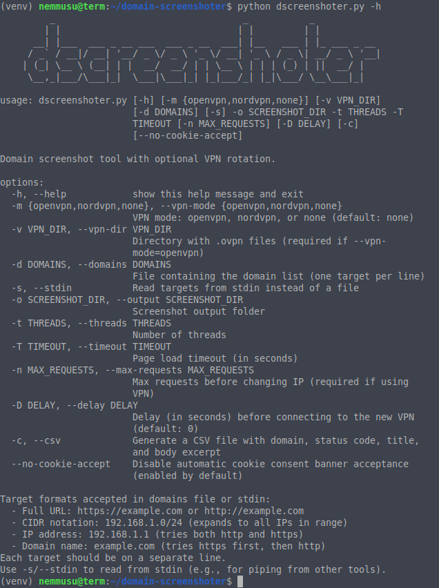
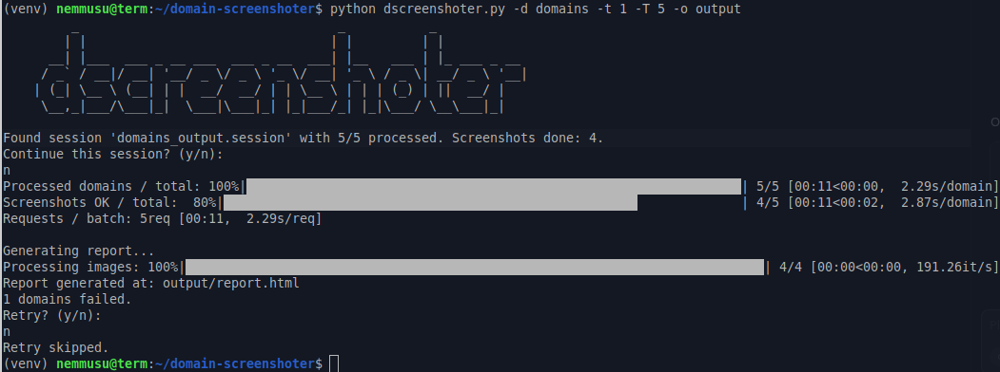
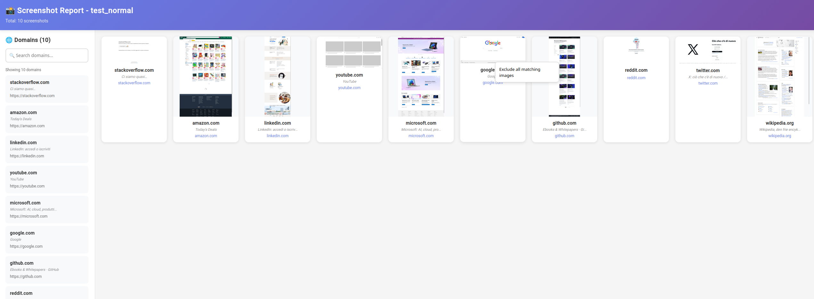
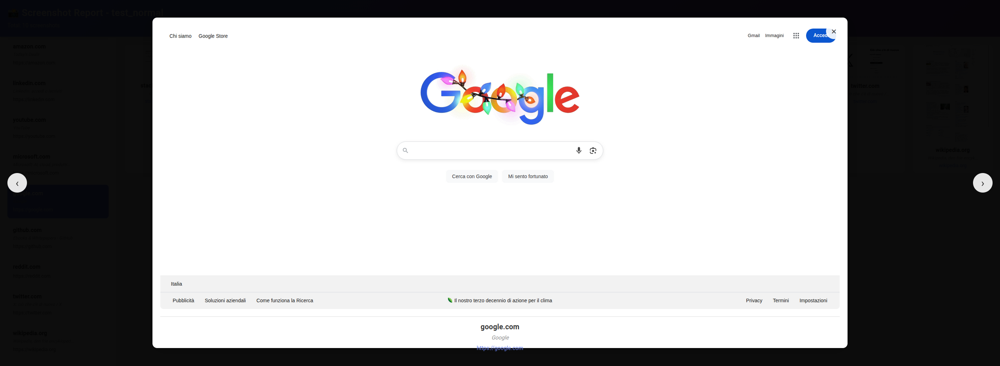

# Domain Screenshoter


This tool automates taking screenshots of a list of domains, optionally routing traffic through a VPN and automatically generates an interactive HTML report for browsing, filtering, and removing visually similar duplicates using perceptual image comparison.

## Features

- **Optional VPN Rotation**: Supports OpenVPN or NordVPN (`-m, --vpn-mode`).
- **Automatic Session Management**: Saves and resumes state across runs.
- **Failure & Retry Mechanism**: Retains failed domains for later retry with IP rotation.
- **Progress Bars**: Provides real‑time feedback on processing domains, screenshots, and requests.
- **Screenshot Automation**: Uses Selenium in headless mode with full-page capture.
- **JavaScript Support**: Since it uses Selenium, it can screenshot pages with JavaScript-rendered content (SPAs, dynamic pages, etc.).
- **Graceful Interrupt Handling**: Safely terminates VPN connections and preserves session data.
- **Automatic Report Generation**: Creates an interactive HTML report after completion.
- **CSV Export**: Optional CSV report with domain, HTTP status code, page title, and body excerpt (`-c/--csv`).

## Requirements

- Python 3.8+
- pip packages: `requests`, `tqdm`, `selenium`, `pillow`, `imagehash`
- Chrome + matching `chromedriver`
  - **Note**: Since the tool uses Selenium with Chrome, it can capture JavaScript-rendered content, including Single Page Applications (SPAs) and dynamically loaded pages.
- OpenVPN CLI (if `-m openvpn`) or NordVPN CLI (if `-m nordvpn`)

## Installation

```bash
git clone https://github.com/nemmusu/domain-screenshoter.git
cd domain-screenshoter
pip install -r requirements.txt
```

Ensure `chromedriver` is configured in `config.ini`:

```ini
[settings]
webdriver_path = /path/to/chromedriver
```

## Usage

```bash
python dscreenshoter.py \\
  [-m {openvpn,nordvpn,none}] \\
  [-v VPN_DIR] \\
  [-d DOMAINS | -s] \\
  -o OUTPUT_DIR \\
  -t THREADS -T TIMEOUT \\
  [-n MAX_REQUESTS] [-D DELAY] \\
  [-c]
```

> **Note**: `-m none` is the default. If you don't specify `-m`, the script runs without VPN.

### Arguments

| Flag | Description |
|------|-------------|
| `-m, --vpn-mode` | VPN mode: `openvpn`, `nordvpn`, or `none` (default: `none`) |
| `-v, --vpn-dir`  | Directory with `.ovpn` files (required if `-m openvpn`) |
| `-d, --domains` | File containing targets, one per line (see Target Formats below) |
| `-s, --stdin` | Read targets from stdin instead of a file (for piping from other tools) |
| `-o, --output` | Directory to store screenshots and report |
| `-t, --threads` | Number of threads for concurrent processing |
| `-T, --timeout` | Page load timeout (in seconds) for Selenium |
| `-n, --max-requests` | Requests per IP before switching VPN (required if using VPN) |
| `-D, --delay` | Delay (in seconds) before re‑establishing VPN (default: 0) |
| `-c, --csv` | Generate CSV report with status code, title, and body excerpt |

**Command-line help:**


### Target Formats

The domains file accepts various target formats, one per line:

- **Full URL**: `https://example.com` or `http://example.com`
  - Used exactly as specified
  
- **CIDR notation**: `192.168.1.0/24` or `10.0.0.0/16`
  - Expands to all IP addresses in the range
  - Each IP is tried with both HTTP and HTTPS
  
- **IP address**: `192.168.1.1` or `8.8.8.8`
  - Tries both HTTP and HTTPS protocols
  
- **Domain name**: `example.com` or `subdomain.example.com`
  - Tries HTTPS first, then HTTP if HTTPS fails
  - No protocol prefix needed

**Example domains file:**
```
https://google.com
http://example.org
192.168.1.0/24
8.8.8.8
github.com
```

**Reading from stdin (for piping from other tools):**
```bash
# Example: pipe from subfinder and httpx
subfinder -d example.com | httpx -silent | python3 dscreenshoter.py -s -o output -t 10 -T 10

# Or from a simple list
echo -e "google.com\ngithub.com" | python3 dscreenshoter.py -s -o output -t 10 -T 10
```

## Sample Commands

### 1. Without VPN (default)

```bash
python dscreenshoter.py \\
    -d domains.txt \\
    -o screenshots \\
    -t 10 -T 10
```

### 2. With OpenVPN

```bash
python dscreenshoter.py \\
    -m openvpn -v /path/to/ovpn \\
    -d domains.txt -o screenshots \\
    -t 20 -T 15 -n 50 -D 5
```

### 3. With NordVPN

```bash
python dscreenshoter.py \\
    -m nordvpn \\
    -d domains.txt -o screenshots \\
    -t 20 -T 15 -n 50 -D 5
```

### 4. With CSV Export

```bash
python dscreenshoter.py \\
    -d domains.txt -o screenshots \\
    -t 10 -T 10 \\
    -c
```

This will generate a `report.csv` file in the output directory with columns:
- `site`: Domain name
- `status_code`: HTTP status code (200, 404, etc.)
- `title`: Page title
- `body_excerpt`: First 200 characters of page body text

## Progress Bars and Sample Output

During execution, the script displays progress bars using `tqdm`. Here's a complete session example:



You will see:
- **Processed domains / total**: how many domains have been handled out of the total.
- **Screenshots OK / total**: how many screenshots succeeded.
- **Requests / batch**: how many requests have been performed in the current VPN batch.

When all domains are processed, or if you cancel, the current session is saved. If domains fail, you can choose to retry them with a fresh VPN connection.

## Resume & Retry

If any domains fail due to timeouts or errors, they are marked in the session file. Upon restart, you can pick up where you left off or start over. The script will also prompt you to retry failed domains at the end.

## Output Files

### CSV Report (optional, with `-c/--csv`)

When using the `-c/--csv` flag, the script generates a `report.csv` file containing:
- **site**: Domain name
- **status_code**: HTTP response status code (e.g., 200, 404, 500)
- **title**: Page title extracted from `<title>` tag
- **body_excerpt**: First 200 characters of the page body text (whitespace normalized)

The CSV is useful for:
- Quick analysis of HTTP status codes
- Extracting page titles for categorization
- Getting text snippets for content analysis
- Importing into spreadsheets or databases

**Note**: When using `-c/--csv`, the script collects additional data during screenshot capture, which may slightly increase processing time per domain (~0.5-1 second).

### Interactive HTML Report

The script **automatically generates** an interactive HTML report (`report.html`) in the output directory after completion. The report includes:

### Features

- **Sidebar Navigation**: List of all domains with search functionality
- **Image Gallery**: Grid view of all screenshots
- **Full-Page Screenshots**: Captures entire page content, not just viewport
- **Modal Viewer**: Click any image to view in full-screen modal
- **Keyboard Navigation**: Arrow keys to navigate, ESC to close
- **Right-Click Menu**: Exclude visually similar images
- **Lazy Loading**: Images load on-demand for better performance
- **Ordered Display**: Domains shown in processing order

### Screenshots

**Main Report View:**


**Modal Image Viewer:**


### Using the Report

1. Open `report.html` in your browser
2. **Search domains**: Use the search box in the sidebar to filter domains
3. **View images**: Click any image in the gallery or sidebar to open in modal
4. **Navigate**: Use arrow keys or click arrows to browse images
5. **Exclude duplicates**: Right-click on an image and select "Exclude all matching images"
6. **Filter management**: Click "X" on filter badges to restore excluded images

The report is optimized to handle hundreds or thousands of domains efficiently with lazy loading and event delegation.


## Troubleshooting

- **VPN Issues**: Verify your VPN CLI (OpenVPN/NordVPN) is installed and configured (note: OpenVPN often requires sudo).
- **Selenium/Chromedriver**: Ensure the `chromedriver` version matches your installed Chrome.
- **Permissions**: Check write permissions for the screenshot directory.
- **Session Files**: Session data is saved in `session/`. If corrupted, remove them before re-running.
- **Report Not Generated**: If the report isn't generated automatically, you can manually run: `python generate_report.py -o <output_dir>`
